Tìm kiếm trên google: unikey download

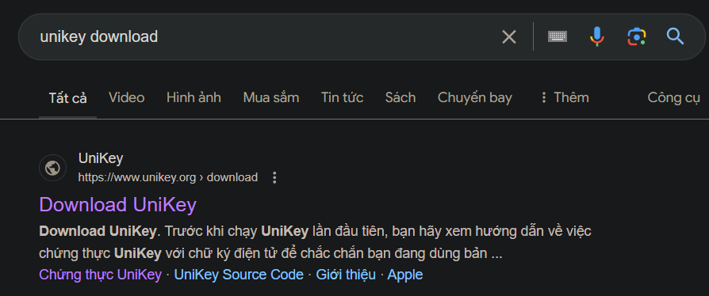

Tìm kiếm Ctrl + F: unikey.org

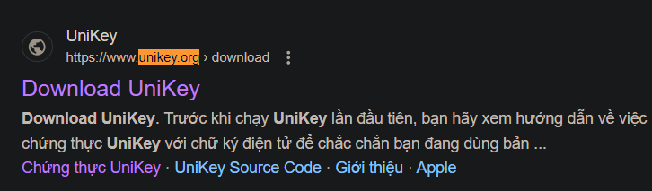

Tìm kiếm Ctrl + F: 64 bit

Sau khi tải xuống được file: unikey46RC2-230919-win64.zip

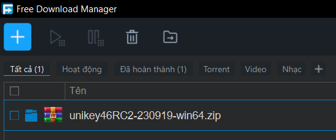

Tạo thư mục: VietNam

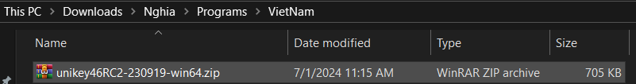

Giải nén file zip: chọn Extract Here

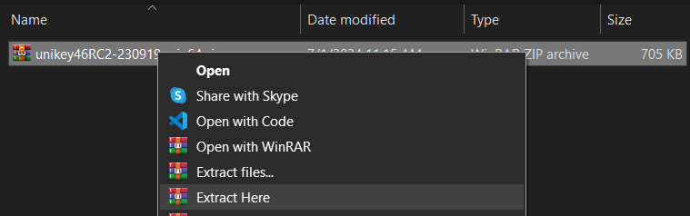

Mở ứng dụng bằng file UniKeyNT.exe

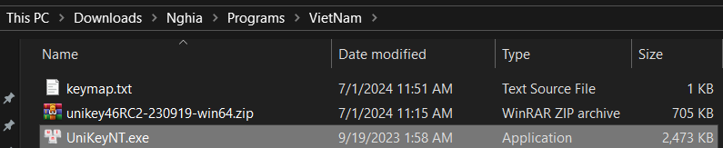

Mở bảng điều khiển

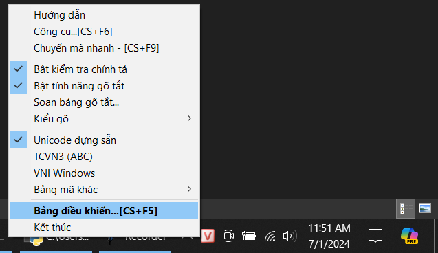

Chọn phím chuyển là ALT + Z

Bat khoi dong cung windows

Mở bảng gõ tắt

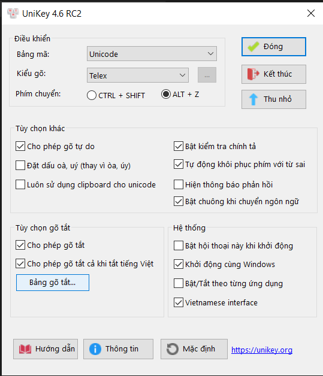

Chọn file để thêm file gõ tắt

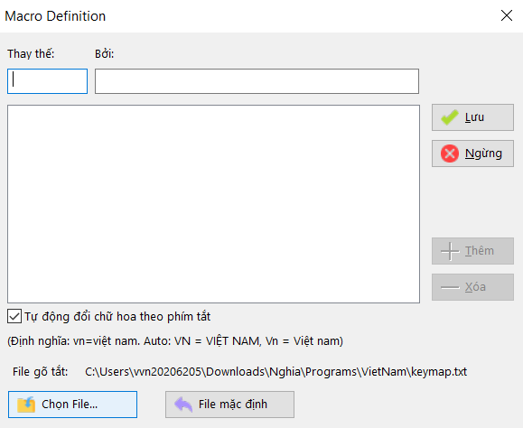

Chọn file keymap.txt

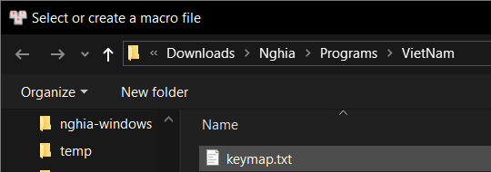

Thử gõ tắt a là abc

Ấn nút thêm

Ấn nút lưu

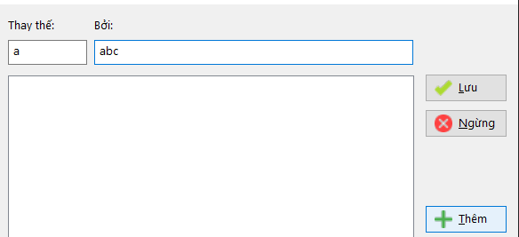

Sử dụng: git clone https://github.com/vuvannghia452002/nghia-UniKey

Cấu trúc mã nguồn

Chọn file keymap.py

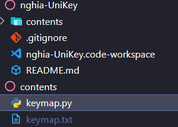

Chạy file keymap.py

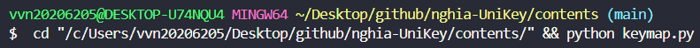

Kết quả link file

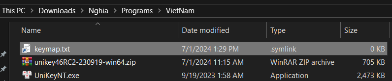
